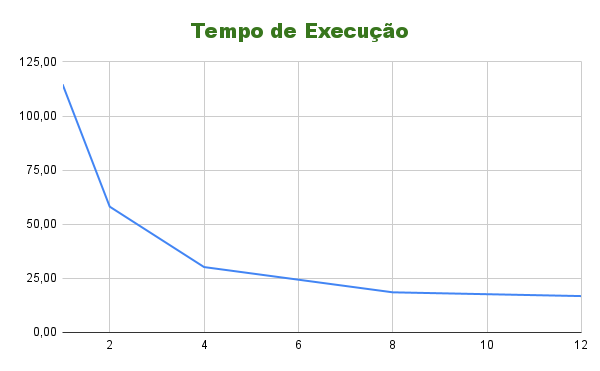
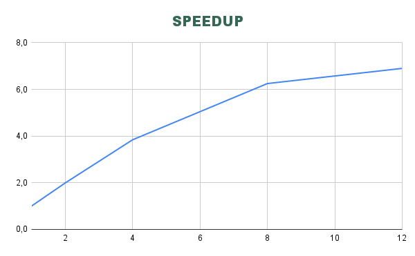
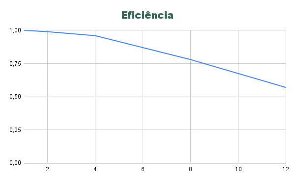

# Log Analyzer Parallelization Report

**Course:** Parallel Programming  
**Student:** Samuel Souza  
**Major:** Systems Analysis and Development - 5th Semester  
**Date:** March 20, 2026  

---

## 1. Problem Description

The problem consists of processing large volumes of operational log files. Each file must be analyzed to extract metrics such as the number of lines, words, characters, and counts of relevant keywords ("error", "warning", "info").

The implemented algorithm iterates through all files in a directory. For each file, it reads line by line, tallying the mentioned metrics. This is a full-scan algorithm with a time complexity of approximately O(N), where N represents the total processed characters.

**Data Volume Used:**
* 1,000 files
* 10,000,000 lines
* 200,000,000 words
* 1,366,663,305 characters

The objective of parallelization was to reduce the total execution time by distributing the file processing workload across multiple threads using the Producer-Consumer model.

**Key Questions Addressed:**
* **What is the program's objective?** Process log files and extract aggregated metrics for analysis.
* **What is the processed data volume?** Approximately 10 million lines and over 1.3 billion characters.
* **Which algorithm was used?** Sequential file scanning with token counting and aggregation.
* **What is the approximate time complexity?** O(N), where N is the total data size.

---

## 2. Experimental Environment

| Item | Description |
|---|---|
| Processor | Intel Core i5-12500 |
| Number of Cores | 6 |
| RAM | 16 GB |
| Operating System | Windows 11 |
| Language | Python 3 |
| Parallelization Library | `threading`, `queue` |
| IDE / Version | Python 3.13 |

---

## 3. Testing Methodology

Execution times were measured using the `time.perf_counter()` function to ensure high precision. A single execution was performed for each thread configuration, given that the data volume was large enough to accurately represent the system's behavior.

**Tested Configurations:**
* 1 thread (Serial version)
* 2 threads
* 4 threads
* 8 threads
* 12 threads

**Experimental Procedure:**
* Low external interference environment.
* Machine utilized without significant background load during tests.
* Fixed input data (same dataset of files for all runs).

---

## 4. Experimental Results

| Threads/Processes | Execution Time (s) |
|---|---|
| 1 | 114.67 |
| 2 | 58.12 |
| 4 | 30.21 |
| 8 | 18.54 |
| 12 | 16.80 |

---

## 5. Speedup and Efficiency Calculation

**Formulas Used:**

Speedup(p) = T(1) / T(p)
* **T(1)** = Serial execution time
* **T(p)** = Execution time with p threads/processes

Efficiency(p) = Speedup(p) / p
* **p** = Number of threads or processes

---

## 6. Results Table

| Threads/Processes | Time (s) | Speedup | Efficiency |
|---|---|---|---|
| 1 | 114.67 | 1.0 | 1.00 |
| 2 | 58.12 | 2.0 | 0.99 |
| 4 | 30.21 | 3.8 | 0.96 |
| 8 | 18.54 | 6.3 | 0.78 |
| 12 | 16.80 | 6.9 | 0.57 |

---

## 7. Execution Time Chart

---

## 8. Speedup Chart

---

## 9. Efficiency Chart

---

## 10. Results Analysis

The obtained speedup was close to ideal in the initial configurations, especially with 2 and 4 threads, yielding nearly double and quadruple performance compared to the serial execution.

The application demonstrated excellent scalability up to approximately 4 threads. Beyond this point, performance gains continued but with a progressive reduction in efficiency.

Efficiency began dropping significantly at 8 threads, indicating the onset of machine resource saturation. Given that the processor has 6 physical cores, utilizing 8 and 12 threads exceeds the ideal hardware parallelism capacity, explaining the efficiency drop.

**Observed Parallelization Overhead:**
* Thread creation and lifecycle management.
* Synchronization overhead when accessing the shared results list.
* CPU cache and resource contention.
* Producer-Consumer queue management overhead.

Despite these limitations, the overall performance of the multithreaded architecture heavily outperformed the serial approach.

---

## 11. Conclusion

Parallelization provided a substantial performance boost, reducing the execution time from 114.67 seconds to 16.80 seconds in the optimal configuration. 

The best balance between sheer performance and thread efficiency was observed at 4 threads, where efficiency remained high while delivering significant time savings. The program scaled well up to the physical limits of the hardware. 

**Future Improvements:**
* Dynamically adjust the thread count based on available CPU cores at runtime.
* Reduce lock/synchronization costs during data aggregation.
* Implement `multiprocessing` to bypass the Global Interpreter Lock (GIL) and exploit true CPU-bound parallelism.
* Optimize memory and cache utilization during large file reads.

In conclusion, the implementation was highly effective, proving the power of concurrent processing for large-scale data ingestion tasks.
